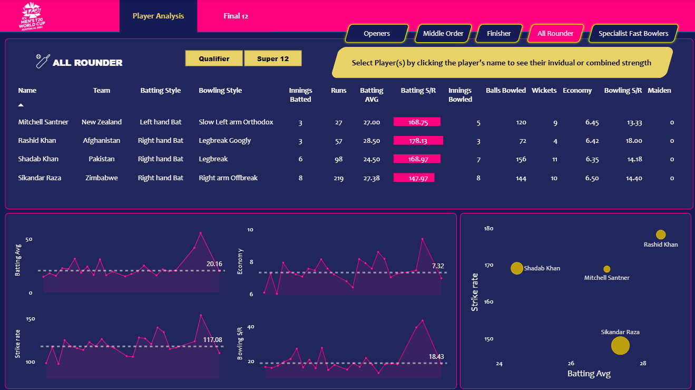

# 🏏 T20 Men's Cricket World Cup 2022 - Player Performance Analysis Dashboard

An **end-to-end interactive data analytics project** that builds a **Power BI dashboard** showcasing the **Best XI players from the T20 World Cup 2022** using **web-scraped data (via Bright Data), Python for ETL, and Power BI for analysis and visualization**.

The dashboard highlights top performers across:

* Opening Batsmen
* Middle-order Players
* All-rounders
* Tail-enders

It enables **cricket enthusiasts, analysts, and learners** to explore **player and team statistics** intuitively, understand performance metrics, and dynamically visualize the **Best Playing XI** from the tournament using a `.pbix` file in Power BI Desktop.

---

## 🎯 Project Objectives

 - Build a **visually appealing, interactive dashboard** for cricket performance analysis.
 - Utilize **real-world data scraping and ETL workflows** with Bright Data and Python.
 - Learn and implement **Power BI best practices** including DAX, Power Query, and dashboard design.
 - Enable **dynamic filtering and analysis of player performances** for insightful decisions.
 - Share a reusable `.pbix` file for open learning and portfolio showcasing.

---

## 📊 Dashboard Features

The dashboard allows users to:

✅ **Explore the dynamically selected Best Playing XI** based on KPIs and role-specific stats.
✅ Analyze **batting and bowling performance** including:

* Batting Average
* Strike Rate
* Runs Scored
* Boundary %
* Bowling Economy
* Dot Ball %
* Wickets Taken
  - ✅ **Compare performance across teams, matches, and player roles.**
  - ✅ Use **interactive slicers** to filter by team, role, or match.
  - ✅ Hover for **in-depth player insights** and role-wise breakdown.
  - ✅ Navigate across report pages: Batting, Bowling, Team Overview, Best XI.

---

## 📷 Dashboard Preview

 <!-- Replace with actual image path -->

---

## 🛠️ Tools & Technologies Used

| Tool / Technology      | Purpose                                                           |
| ---------------------- | ----------------------------------------------------------------- |
| **Python**             | Data scraping (ETL), cleaning, transformation                     |
| **Bright Data**        | **Reliable web scraping infrastructure** to extract Cricinfo data |
| **BeautifulSoup**      | Parsing scraped HTML data                                         |
| **Pandas**             | Data cleaning, manipulation, and exporting to CSV                 |
| **Jupyter Notebook**   | Scripting and documenting ETL processes                           |
| **Power BI**           | Interactive visualization, DAX-based metrics, dashboard creation  |
| **Power Query Editor** | Final data shaping within Power BI                                |
| **DAX**                | KPI measures and calculated columns for performance analysis      |

---

## 🌐 Data Source

* **Primary Data:** [ESPN Cricinfo](https://www.espncricinfo.com/) — Match and player-level stats.
* **Web Scraping Tool:** **Bright Data** for structured, scalable, and paginated data extraction.
* Data parsed using **BeautifulSoup**, cleaned using **Pandas**, and exported to `.csv` for Power BI.

---

## 🔄 ETL & Project Workflow

### 1️⃣ Requirement Scoping

Identified a need for a cricket performance dashboard highlighting a dynamic **Best XI team** using statistical insights.

### 2️⃣ Data Extraction (E)

Used **Bright Data** to efficiently scrape T20 WC 2022 data from Cricinfo, covering player stats, match info, and role-based attributes.
Handled structured HTML, pagination, and dynamic content using BeautifulSoup.

### 3️⃣ Data Transformation (T)

Used **Pandas in Python (via Jupyter Notebook)** to:

* Handle missing values
* Normalize formats and types
* Derive key features: Boundary %, Dot Ball %, Performance Index, etc.
* Merge and structure datasets into analysis-ready `.csv` files

### 4️⃣ Data Loading (L)

Imported clean `.csv` datasets into **Power BI** using **Power Query Editor** for final shaping.
Defined relationships among tables for slicing, filtering, and calculations.

### 5️⃣ Data Modeling & DAX

Created powerful DAX measures and calculated columns for:

* Role-specific KPIs
* Dynamic Best XI logic
* Team-wise comparison
* Visual cue formatting

### 6️⃣ Dashboard Design

Built a multi-page interactive dashboard with:

* KPI cards
* Slicers
* Tooltips
* Filters
* Role breakdown visuals

### 7️⃣ Finalization & Deployment

Packaged everything into a reusable `.pbix` file for learning, feedback, and personal portfolio use.

---

## 📈 Learning Outcomes

- ✅ **ETL Pipeline**: End-to-end understanding of data flow — from Bright Data extraction to Power BI presentation.
- ✅ **Web Scraping Automation**: Real-world scraping with Bright Data and Python.
- ✅ **Pandas-based Data Cleaning & EDA**: Preparing structured cricket data for BI consumption.
- ✅ **Power BI Skills**: Mastered Power Query transformations, DAX measures, and storytelling through visuals.
- ✅ **Cricket Analytics**: Developed the ability to analyze player impact using advanced metrics.

---

## 📤 Contact

Want to collaborate on data analytics, Power BI dashboards, or cricket-based insights?
📧 Email: [shrutijaiswal2905@gmail.com](mailto:shrutijaiswal2905@gmail.com)

---

## ⭐ Final Notes

This project combines the **ETL pipeline**, **sports data scraping**, and **Power BI visualization** in a single end-to-end workflow. A great hands-on project for **aspiring data analysts**, **Power BI learners**, and **sports analytics enthusiasts** looking to create impactful, data-driven dashboards.

---
